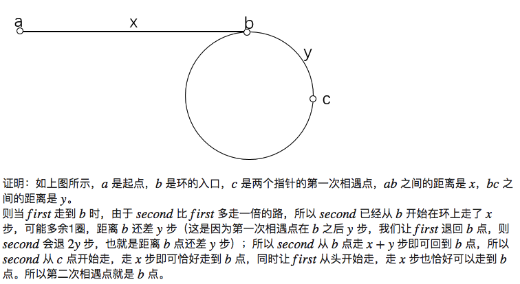

- 为了避免特殊判断 可以在链表头加入空节点
 - 例：LeetCode 19
    ```
    给定一个单向链表，要求删除从结尾数第n个结点，并返回修改后的表头。
    ```
    ```python
    def removeNthFromEnd(self, head, n):
          """
          :type head: ListNode
          :type n: int
          :rtype: ListNode
          """
          if not head:
              return None

          fake = ListNode(-1)
          fake.next = head
          cur = fake
          size = 0

          while cur and cur.next:
              cur = cur.next
              size += 1

          runner = fake
          for i in range(size-n):
              runner=runner.next

          runner.next = runner.next.next

          return fake.next

    ```

- 翻转链表
 - 例：LeetCode 206
    ```
    翻转一个单链表。
    进一步： 能否同时给出迭代算法和递归算法？
    ```
 - 非递归方式
    ```python
    def reverseList(self, head):
        """
        :type head: ListNode
        :rtype: ListNode
        """
        prev = None
        curr = head
        while curr:
            nextTemp = curr.next
            curr.next = prev
            prev = curr
            curr = nextTemp
        return prev

    ```
  - 递归方式
    ```python
      def reverseList(self, head):
          if not head:
              return
          prev = None
          return self.helper(head, prev)  
      def helper(self, p, prev):
          if not p:
              return prev
          next = p.next
          p.next = prev
          return self.helper(next, p)
    ```

- 双指针
  - 寻找第k个节点：第二个指针在第一个节点移动k个节点后出发 两节点一起移动知道第一个节点到null
  - 寻找中间节点：每次一个节点向前移动一位 另一个移动两位 直至一个节点移动到null
  - 判断是否有环：同上 如果两个指针重叠则存在环
  ```
  假设链表存在环，则当第一个指针走到环入口时，第二个指针已经走到环上的某个位置，距离环入口还差 x 步。
  由于第二个指针每次比第一个指针多走一步，所以第一个指针再走 x步，两个指针就相遇了。
  ```
  - 判断环的入口：同上 当两个指针重叠时令一个指针返回起点 再令两个指针同时向前走一步 重叠时为入口
  
  - 判断两个链表是否相交: 两个指针分别从两个链表头开始移动，如果指针到了null就从另一个链表头则从另一个链表头开始移动 如果两个指针重叠则重叠位置为交汇点
